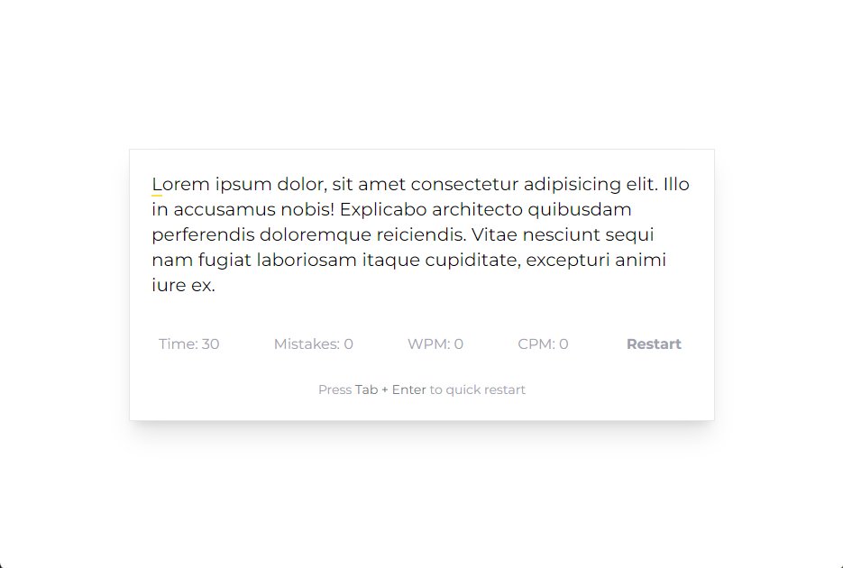

# Typing Speed Test
A React-based typing speed test application that measures your typing speed in words per minute (WPM) and characters per minute (CPM) while tracking mistakes. This project is divided into multiple components for better maintainability and readability.



## Features
- Typing text highlighting correct and incorrect characters
- Real-time WPM and CPM calculation
- Tracks mistakes
- Timer to limit typing duration
- Restart functionality

## Getting Started

1. Clone the repository
```
git clone https://github.com/ixedasan/react-typing-speed-test.git
cd typing-speed-test
``` 
2. Install dependencies:
```
npm install
```
3. Start the development server:
```
npm run dev
```
## Usage
The application starts with a preset text. As you type, correct characters are highlighted in green and incorrect ones in red. The timer starts when you begin typing and counts down from 30 seconds. WPM and CPM are calculated in real-time. You can restart the test at any time by clicking the "Restart" button.

## Contributing
Contributions are welcome! Please open an issue or submit a pull request for any improvements or bug fixes.